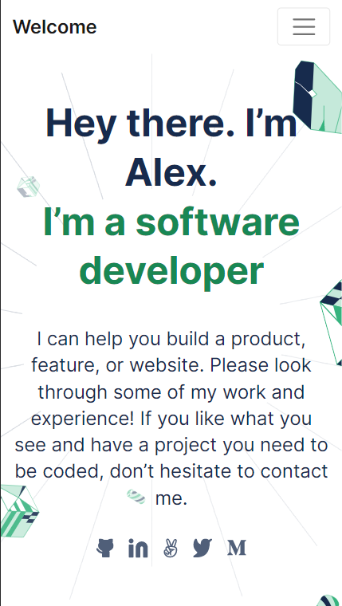
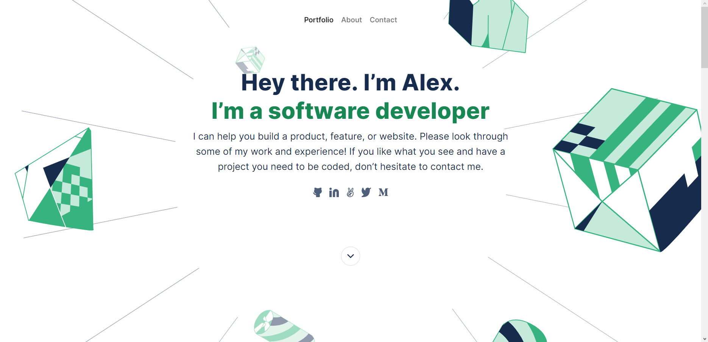

# Portfolio: Bootstrap

"Your portfolio is one of the most powerful tools in your software developer toolbox; it’s the easiest way of showing what you’re truly capable of as a developer, and is a quick and simple way for recruiters and hiring managers to get an idea of what you can bring to their teams." - Microverse

This project consists in building a copy of a portfolio template from scratch using Bootstrap, by choosing one of the [Microverse templates](https://www.figma.com/file/l7SqJ3ZfkAKih9sFxvWSR4/Microverse-Student-Project-1?node-id=1%3A1471) and sticking to that design (we chose Template 3).

## Mobile

## Desktop

## Built With

- HTML5
- CSS3
- Visual Studio Code
- Git & Github

## Live Demo

Not yer deployed

## Getting Started

To get a local copy up and running follow these simple example steps.

- Clone repo into your machine. For this, follow these steps:
  - Open a terminal of your choice (e.g. VS Code integrated terminal)
  - Select the destination folder (On windows, run cd "_Destination folder_")
  - Run git clone https://github.com/mustabbas/mustDico-Bootstrap
- Open the destination folder in your preferred file explorer
- Open folder "Portfolio"
- Open index.html

### Prerequisites

Any modern web browser will do.

### Setup

Follow the steps described before.

### Install

N/A

### Usage

N/A

### Run tests

N/A

### Deployment

N/A

## Authors

👤 **Dico Diaz Dussan**

- GitHub: [@dicodiaz](https://github.com/dicodiaz)
- Twitter: [@DicoDiaz1](https://twitter.com/DicoDiaz1)
- LinkedIn: [Dico Diaz Dussan](https://www.linkedin.com/in/dico-diaz-dussan-476106a6/)

👤 **Mustafa Abbas**

## 🤝 Contributing

Contributions, issues, and feature requests are welcome!

Feel free to check the [issues page](../../issues/).

## Show your support

Give a ⭐️ if you like this project!

## Acknowledgments

- Hat tip to anyone whose code was used
- Inspiration
- Microverse program
- Our standup team
- Our code reviewers

## 📝 License

This project is [MIT](./MIT.md) licensed.
